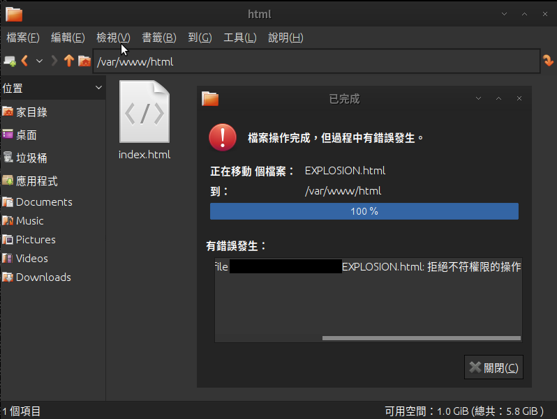
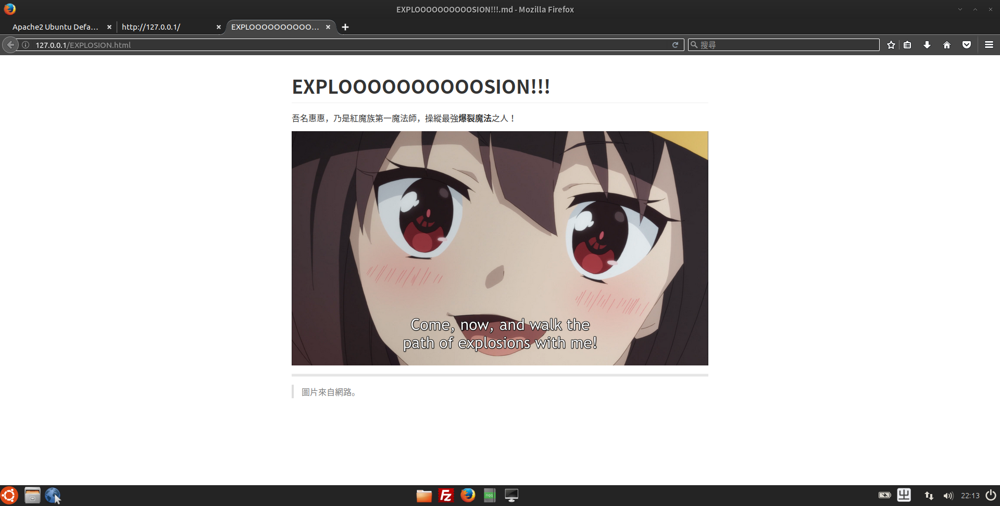
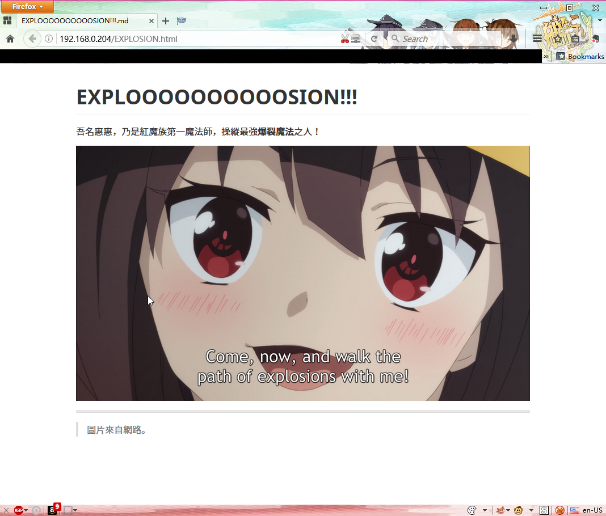

# Apache 伺服器簡易教程 - 添加內容篇

> Apache HTTP server - Part 2

> 你聽說過安 ... 啊不對，自由軟體嗎？

> Ver: 2.1

> Copyright © 2017 undecV.
> 
> This work is licensed under a [Creative Commons Attribution-ShareAlike 4.0 International License](http://creativecommons.org/licenses/by-sa/4.0/).

---

在上一個簡易教程當中，我們已經架設好了 **Apache** 網頁伺服器。
這一節將介紹怎麼將你的純手工手製初回生產限定非轉基因限量版網頁放進你的網頁伺服器當中。

在開始之前，先複習一下「URL」的內容，如果你並不清楚「URL」是什麼，請時空穿越到上課的時候認真聽講。

當我們在網頁瀏覽器中輸入地址 `127.0.0.1` 時，其實我們訪問的較爲完整的 URL 是 `http://127.0.0.1:80/index.html` ，其意義大概是：使用 `HTTP` 協定連接到 `127.0.0.1` 伺服器的 `Port 80` ，取得 `index.html` 資源。

爲什麼你只輸入了主機的 IP 位址就可訪問了呢，當然是因爲你的瀏覽器和網頁伺服器英明神武，知道你根本就懶得打那麼多字，而且也 *猜到* 你是想訪問這個主機的網頁，其他的部分幫你自動生成了：

- `index.html` 文件是被當成該路徑的 **主頁** ，所以被省略 ；
- `:80` 是因爲 `HTTP` 協定通常使用 `Port 80` ，所以被省略；
- `http://` 是瀏覽器 *猜到* （你使用網頁瀏覽器不看網頁是做什麼呢w）你是想訪問這個主機的網頁，所以幫你自動補全了，當然現代的瀏覽器也可能會支持其他的協定，例如 FTP。

那麼， `index.html` 在哪裏？就在 `/var/www/html` 路徑下，這裏就是 **網頁伺服器存取的預設路徑** （當然也可以修改，在 Apache 的設定中）。

所以，把自己的網頁內容放到這個路徑下，就可以被訪問了不是嗎。
（溫馨提示，若是你的網頁引用了其他的資源（例如圖片文件）也要一起放進來喔。）

恩，好像很有道理，那麼就來試試看...～

嗯...放不進去...～當然錯誤提示很明顯的，是 **操作權限** 的問題，請自尋解答w。

接下來就是訪問我們的頁面，我們想要做的是：使用 `HTTP` 協定連接到 `127.0.0.1` 伺服器的 `Port 80` ，取得 `EXPLOSION.html` 資源。所以，實際上較爲完整的 URL 是：`http://127.0.0.1:80/EXPLOSION.html` 所以，你只要在瀏覽器中輸入：`127.0.0.1/EXPLOSION.html`  即可。

然後我們用其他的主機試試看：

成功了誒...～

還有另一種情況，若是我們將自己的網頁放入一個資料夾中呢？
我們將自己的網頁放在 `/var/www/html/MY_PAGE` 中，那麼，我們想要做的就是：使用 `HTTP` 協定連接到 `127.0.0.1` 伺服器的 `Port 80` ，取得 **路徑 `/MY_PAGE` 下** 的 `EXPLOSION.html` 資源。較爲完整的 URL 是：`http://127.0.0.1:80/MY_PAGE/EXPLOSION.html` ，其路徑 `/MY_PAGE` 是相對于 `/var/www/html` 路徑下，例如：

- `http://127.0.0.1:80/MY_PAGE/EXPLOSION.html` -> `/var/www/html/MY_PAGE/EXPLOSION.html` 
- `http://127.0.0.1:80/EXPLOSION.html` -> `/var/www/html/EXPLOSION.html` 

這樣我們的網頁也部署完成了。

------

- Environment: 
  - Windows 10
  - with VirtualBox 5.1.10
  - Lubuntu 16.10
- See also: 
  - > Uniform Resource Locator - Wikipedia
    > https://en.wikipedia.org/wiki/Uniform_Resource_Locator
  - > 鳥哥的 Linux 私房菜 -- WWW 伺服器 Apache
    > http://linux.vbird.org/linux_server/0360apache.php
- Release Notes:
  - 2.1 Update (20170207):
    - 修改標題，啊現在你知道你點開的是什麼了吧。
    - 修改文件目錄。
    - 授權的鏈接的 `HTML` 使用 `Markdown` 改寫。
  - 2.0 Update (20170128):
    - 變更授權：`Creative Commons License` 。
    - 艾瑪我連梗都會打錯我的鍵盤真是業障重啊。
    - 細節修正。
    - 內容整合。