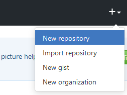
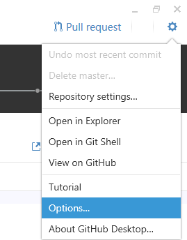
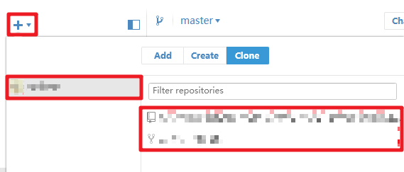

# 不用代碼也可以使用 Git

> ~~我亂說的。~~

> 從零開始的 Git 使用教程。
> **GitHub Desktop 與 GitHub 篇。**

> Copyright © 2017 undecV.
> 
> This work is licensed under a [Creative Commons Attribution-ShareAlike 4.0 International License](http://creativecommons.org/licenses/by-sa/4.0/).

------

- 在上文（[不用代碼也可以使用 Git 系列之 GitHub Desktop 客戶端篇](GHDt_V1.md)）中，你已經完成了 GitHub Desktop 的設定，也了解的最基本的 Git 操作在 GitHub Desktop 下如何完成。
- 本文將會告訴你，如何在 GitHub Desktop 中，與 GitHub 愉快的玩耍。

1. 到 [GitHub](https://github.com/) 註冊賬戶。（我再略！
2. - 在 GitHub 網頁中如何創建一個版本庫，在頁面最上方的 `+` 菜單中選擇 `New repository`，並填入相關的資訊（名字，描述，公開，授權，etc...）。
      請注意 GitHub 免費版是不支持私有版本庫的。
- 
3. 設定 GitHub Desktop： 
   - 右上角的 齒輪，然後選擇 Options...。
     - 
   - 設定項目，其中的：
      1. Accounts：你的 GitHub 賬戶，點擊 `Add account` 登錄你的賬戶。
      2. Configure git：你的 Git 配置，要使用 Git 你需要一個全名（`Full name`）和電郵地址（`Email`），請與在註冊 GitHub 時所填寫的一致，這樣 Git 才會知道誰提交了編輯。
      - 

- 這樣，你的 GitHub Desktop 就設定完了，
  那麼，該如何在 GitHub Desktop 中，與 GitHub 愉快的玩耍呢？
  - 點擊左上角的 `+` 號，選擇 `Clone`，然後在左方你可以看到你的賬戶，右邊則有你在 GitHub 上託管的版本庫，選擇你需要克隆的版本庫。
  - 

- 之後的操作就跟上一個教程差不多了。
- 最後，你已經了解了在 GitHub Desktop 下如何使用 GitHub 託管的版本庫。那麼，你也可能感興趣：

    - 不用代碼也可以使用 Git 系列之

        - [GitHub Desktop + Bitbucket 篇](GHDt+Bb_V1.md) 

------

- See also:

- Release Notes:

  - 1.0 Publish (20170302)