# 超高速的 VirtualBox + Lubuntu 安裝方法

> 最高速 Fall in Love ... 啊不對，裝系統。

> Ver: 2.1

> Copyright © 2017 undecV.
> 
> This work is licensed under a [Creative Commons Attribution-ShareAlike 4.0 International License](http://creativecommons.org/licenses/by-sa/4.0/).

---

給臨時抱佛腳的同學，還有電腦性能在虛擬機中跑 Ubuntu 比較慢的同學。
跑安裝全過程加碼字一個小時多，實際上你不需要一邊碼字一邊安裝還是很快的。

**Lubuntu** 是 **Ubuntu** 的一個分支，屬於 **輕量級的 Linux 發行版** （對比 Ubuntu 家的 ISO 體積就知道了），需要的硬體需要不那麼高，即使在老舊和低性能的電腦上也可以順暢運行（當然在高性能的電腦的也會更快）。界面上有點像 Windows 和 樹莓派 的 Raspbain，操作上不會有那麼強的違和感。
- Ubuntu 家族安裝 `iso` 文件對比。
  - 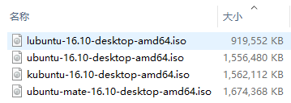
- Lubuntu 桌面環境。
  - 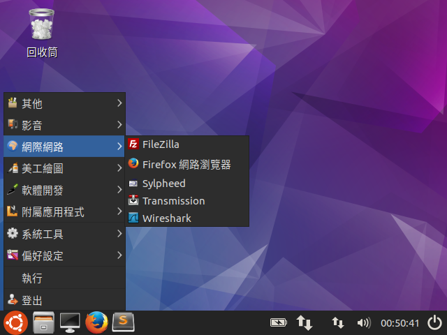

0.   這是在 `Windows` 下操作的。
1.   根據你電腦的位元（32 或 64）下載作業系統和 `VirtualBox` ：
-   > lubuntu | lightweight, fast, easier
    > http://lubuntu.net/
    - 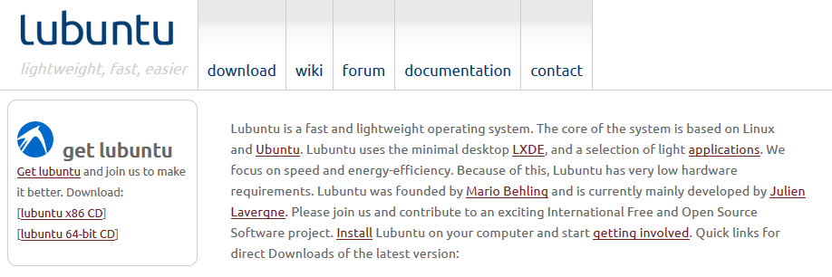

-   > Downloads – Oracle VM VirtualBox
    > https://www.virtualbox.org/wiki/Downloads
    - 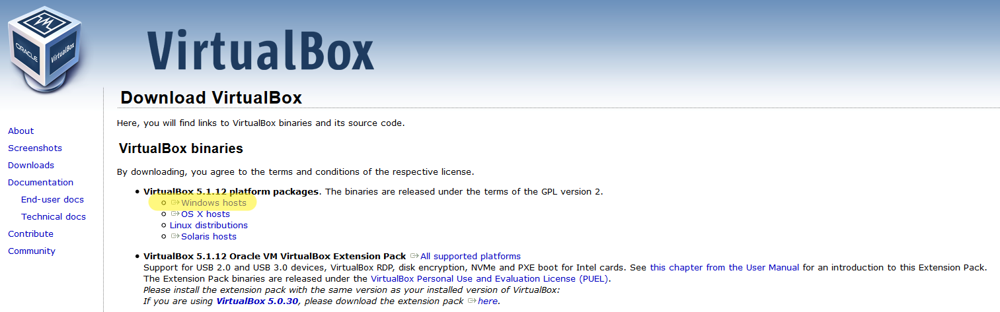
2.   安裝 `VisualBox` ：略。
3.   建立虛擬機：
     - 左上角的 `New` ，填入 `Name` ，選擇 `Type` 和 `Version` 。
       > 提示：在 Name 輸入 Ubuntu 相關的字串下面會自動選擇。
       - 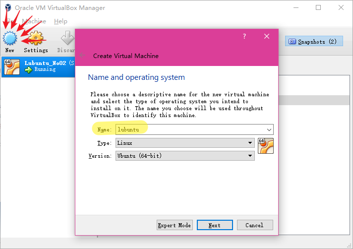
4.   設定記憶體：
     - 根據你電腦的情況給虛擬機設定記憶體（RAM，拉姆，雷姆的姐姐）大小。
       > 8GB 的 RAM 給 2048 MB 差不多，不要太小，也不要太大。
       - 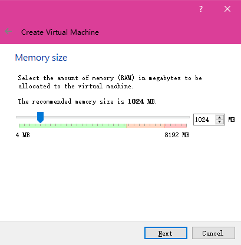
5.   建立虛擬硬碟：
     - 選擇立即建立新硬碟（ `Create a virtual hard disk now` ）。
     - 選擇硬碟類型， `VDI` 。
     - 動態配置大小（ `Dynamically allocated` ）。
     - 設定硬碟大小，一般向 30GB 左右，根據自己的需求而定。
       - 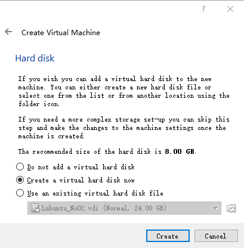
       - 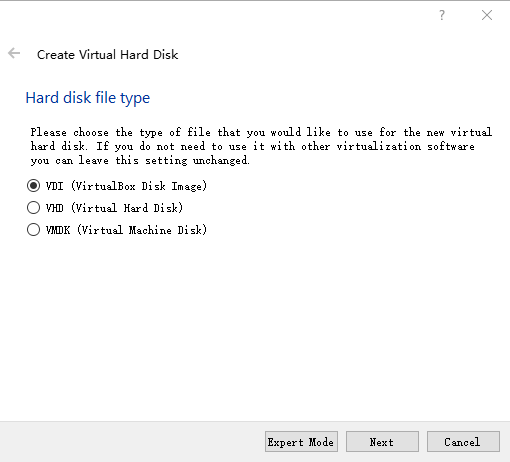
       - 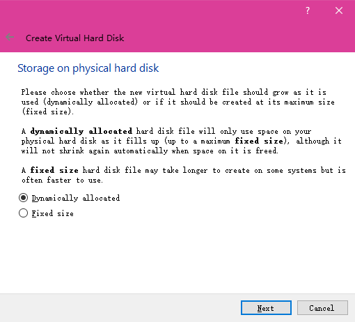
       - 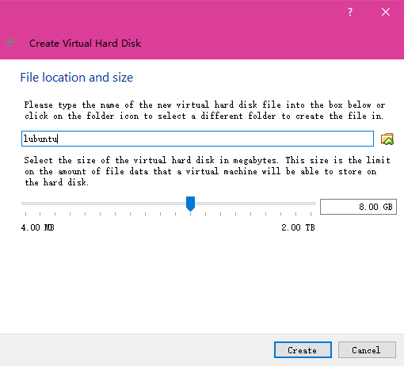
6.   設定 `Setting` ，對系統優化。
     - Display -> Screen -> Video Memory：最大。
     - Display -> Screen -> Enable 3D Acceleration：勾選。
     - Storage：掛載安裝 CD。
       - 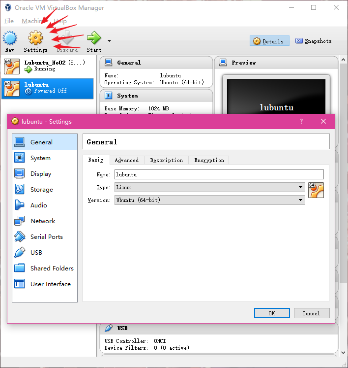
       - 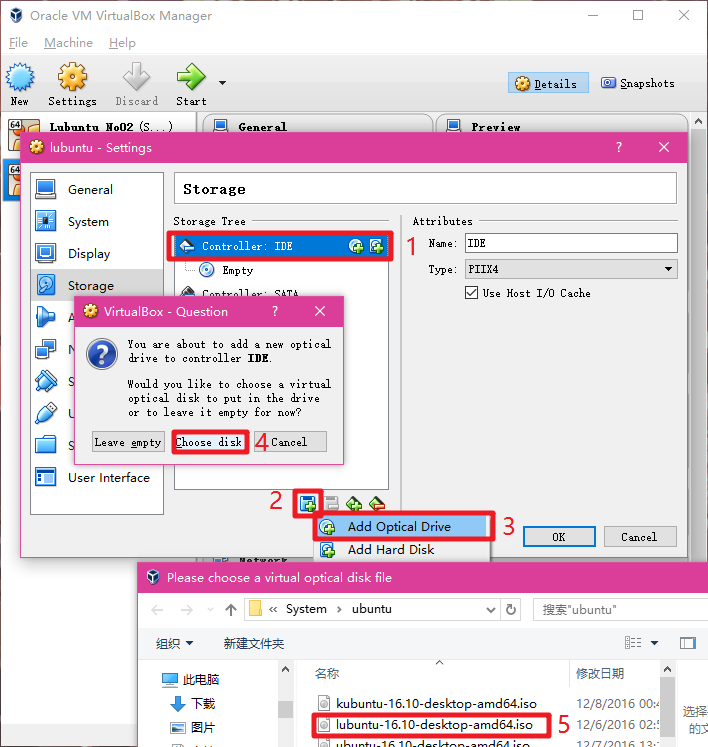
7.   開機 `Start` 。
     - 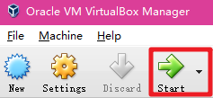
8.   安裝系統：
     - 選擇語言：你讀得懂的。
       - 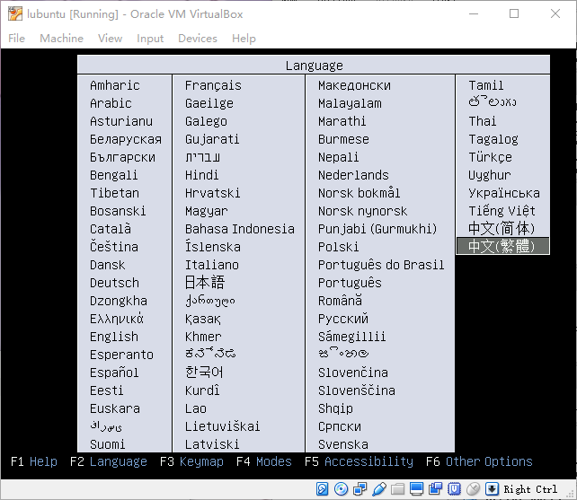
     - 選擇：安裝 `lubuntu` （ `Install Lubuntu` ）。
       - 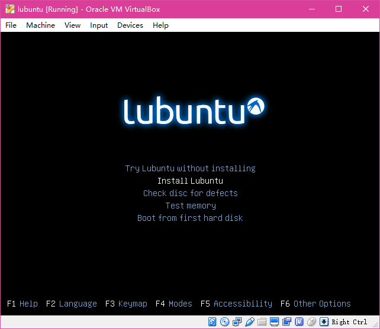
     - 還是選擇語言：你讀得懂的。
       - 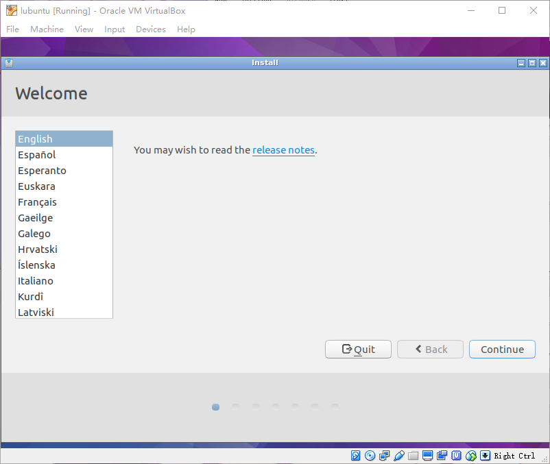
     - 安裝準備：
       > 建議全勾選，自己看下面的解釋，下同。
       > 按 `Continue` 之後會停住一段時間，正常，等它跑完。
       - 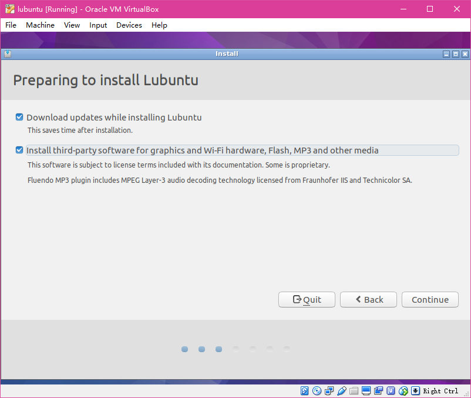
     - 硬碟選項：
       > 根據需要調整，一般默認就好。
       > 按 `Continue` 之後會停住一段時間，正常，等它跑完。
       - 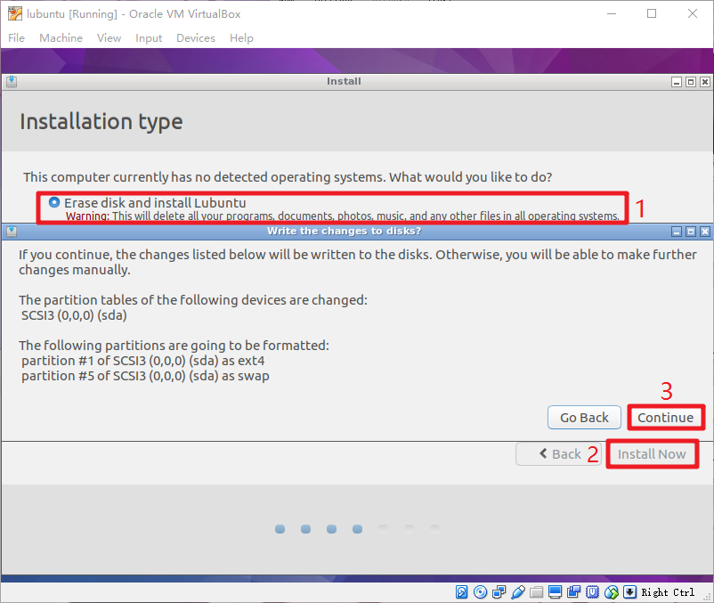
       - 地區選項：
         > 根據需要調整。
         - 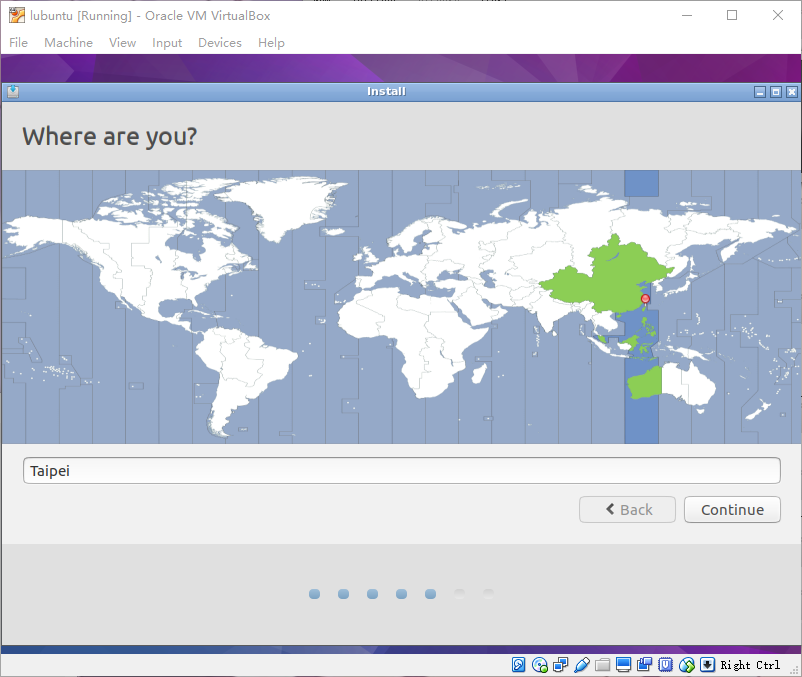
       - 鍵盤選項：
         > 根據需要調整。
         > 按鈕 `Continue` 可能因爲熒幕不夠大沒顯示出來，就移動一下視窗。
         - 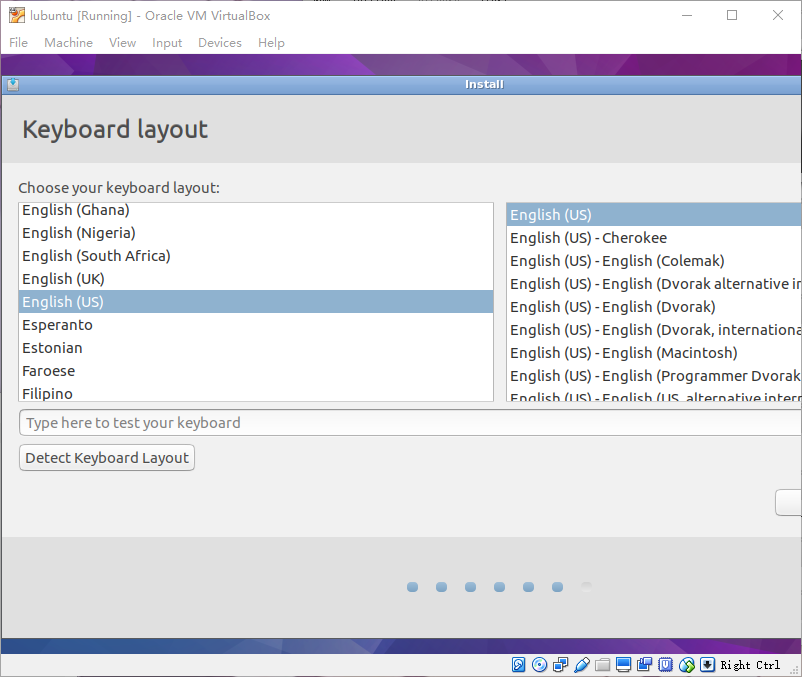
       - 賬戶選項：
         > 根據需要填寫。
         > 勾選 `Log in automatically` 可以每次登錄時不要輸入密碼。
         - 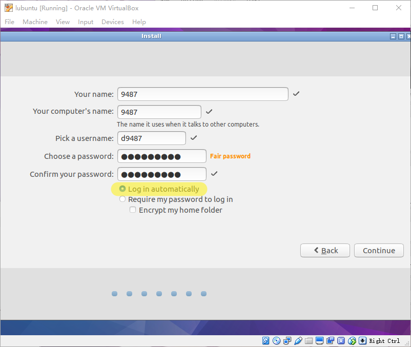	
9.   等它安裝：
     > 等好等滿。
     - 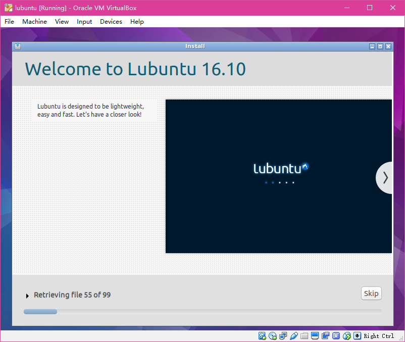
10.   裝完了，重新開機：
     - 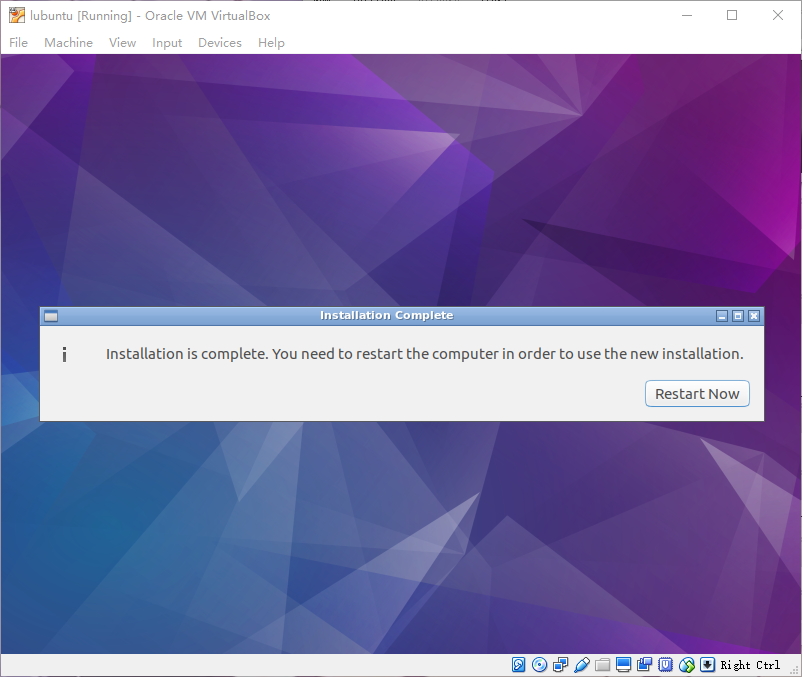
11.   然後，然後它就成功了：
     - 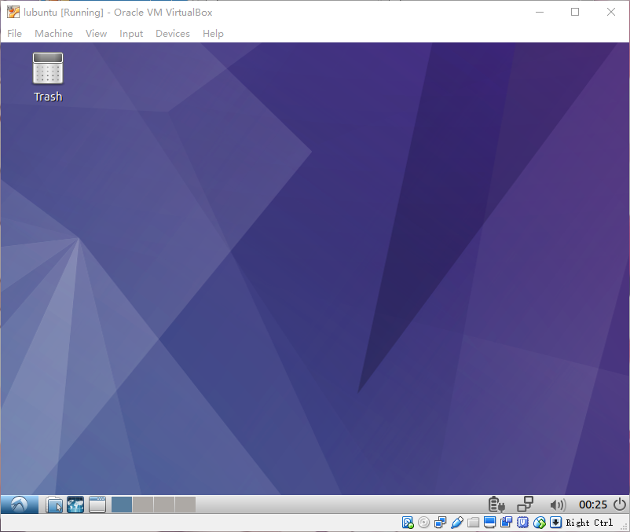
12.   最後， **溫馨提示** ，記得設定快照：
       > 各位在玩虛擬機的時候記得建立快照（Snapshots），爆炸了之後可以用這個東西恢復搶救回來。
       > EXPLOOOOOOOOOOPSION!!!
     - 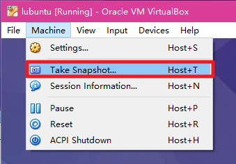
     - 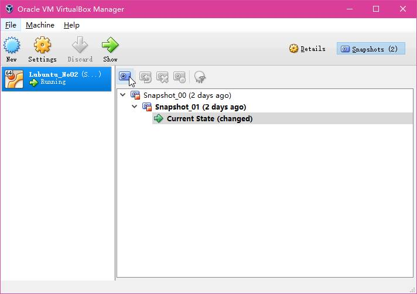
---

- Environment: 
  - Windows 10
  - with VirtualBox 5.1.10
  - Lubuntu 16.10
- Release Notes:
  - 2.1 Update (20170207):
    - 修改文件目錄。
    - 授權的鏈接的 `HTML` 使用 `Markdown` 改寫。
    - 細節修正。
  - 2.0 Update (20170128):
    - 變更授權：`Creative Commons License` 。
    - 新增一個捏它。
    - 細節修正。
    - 內容整合。
